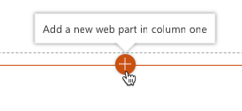
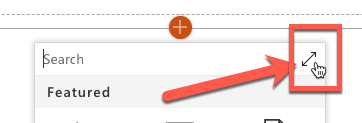
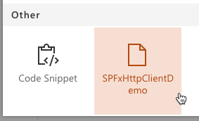
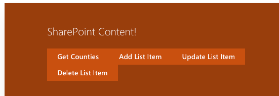
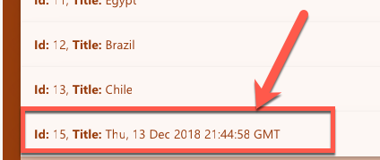
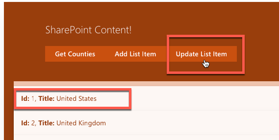
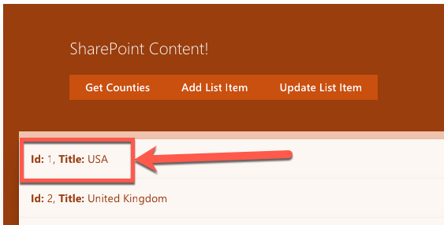
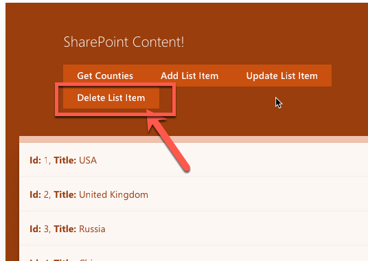

# DEMO: CRUD with SharePoint Data

In this demo, you will extend the SPFx project from the previous demo to add write capabilities using the SharePoint REST and SPFx APIs.

1. Install the project dependencies:
    1. Open a command prompt and navigate to the folder that contains this demo.
    1. Execute the following command:

        ```shell
        npm install
        ```

1. Start the local web server and test the web part in the hosted workbench:

    ```shell
    gulp serve
    ```

1. The browser will load the local workbench, but you can not use this for testing because there is no SharePoint context in the local workbench. Instead, navigate to the SharePoint Online site where you created the **Countries** list, and load the hosted workbench at **https://[sharepoint-online-site]/_layouts/workbench.aspx**.

1. Add the web part to the page: Select the **Add a new web part** control...

    

    ...then select the expand toolbox icon in the top-right...

    

    ...and select the **SPFxHttpClientDemo** web part to add the web part to the page:

    

1. The web part will appear on the page with four buttons and no data in the list:

    

1. Select the **Get Countries** button and examine the results returned... scroll to the bottom of the list and notice there is no entry with a timestamp for the **Title**.
1. Select the **Add List item** button and scroll to the end of the results returned. Notice the new item that appears with a timestamp as the **Title**.

    

1. Test the update process by selecting the **Update List Item** button. Notice before selecting it the title of the **United States** item:

    

    Notice after selecting the button, the title has changed:

    

1. Test the delete process by selecting the **Delete List Item** button. Notice before selecting it the last item in the last... in this case, the item with the timestamp for the **Title**:

    

    Notice after selecting the button, the last item in the list has been removed.

1. Stop the local web server by pressing <kbd>CTRL</kbd>+<kbd>C</kbd> in the console/terminal window.

## Suggested files to Explore in "how it works"

- **./src/webparts/spFxContent/SpFxContentWebPart.ts**
- **./src/webparts/spFxContent/components/ISpFxContentProps.ts**
- **./src/webparts/spFxContent/components/SpFxContent.tsx**