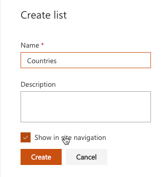
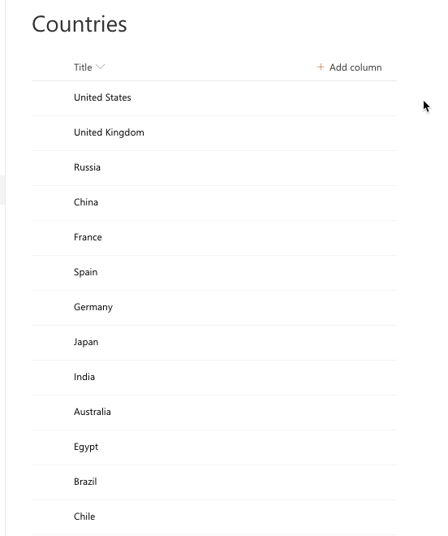
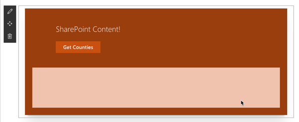
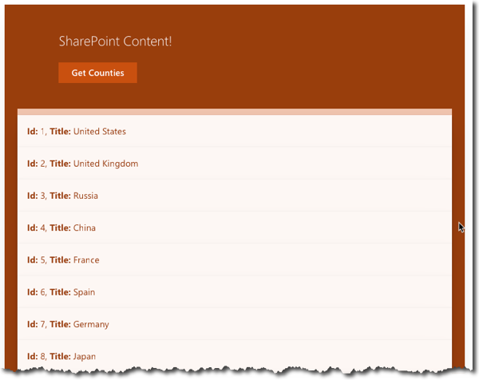
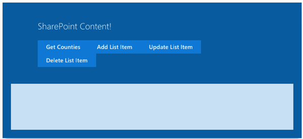
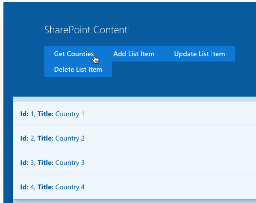

# Working with SharePoint Content

In this lab you work with the SharePoint Framework to perform CRUD operations on SharePoint lists and libraries.

## In this lab

- [Using SPHttpClient to talk to SharePoint](#exercise1)
- [CRUD with SharePoint Data](#exercise2)
- [Using Mocks to Simulate SharePoint Data](#exercise3)

## Prerequisites

To complete this lab, you need the following:

- Office 365 tenancy
  > If you do not have one, you obtain one (for free) by signing up to the [Office 365 Developer Program](https://developer.microsoft.com/office/dev-program).
- Local SharePoint Framework development environment installed and configured
  - Refer to the SharePoint Framework documentation, specifically the **[Getting Started > Set up development environment](https://docs.microsoft.com/sharepoint/dev/spfx/set-up-your-development-environment)** for the most current steps

<a name="exercise1"></a>

## Exercise 1: Using SPHttpClient to talk to SharePoint

In this exercise you will create a SharePoint Framework (SPFx) web part that will get and display data from a SharePoint list.

### Create a List of Countries for Sample Data

1. In a browser, navigate to a site collection in SharePoint Online.
    1. Select **Site Contents** in the left-hand navigation.
    1. Select **New > List** in the toolbar.
    1. Set the list name to **Countries** and select **Create**.

        

    1. Add items to the list by entering the names of different countries as shown in the following image.

        

### Create the web part to display data using the SharePoint REST API

> NOTE: The instructions below assume you are using v1.9.1 of the SharePoint Framework Yeoman generator.

1. Open a command prompt and change to the folder where you want to create the project.
1. Run the SharePoint Yeoman generator by executing the following command:

    ```shell
    yo @microsoft/sharepoint
    ```

    Use the following to complete the prompt that is displayed:

    - **What is your solution name?**: SpFxHttpClientDemo
    - **Which baseline packages do you want to target for your component(s)?**: SharePoint Online only (latest)
    - **Where do you want to place the files?**: Use the current folder
    - **Do you want to allow the tenant admin the choice of being able to deploy the solution to all sites immediately without running any feature deployment or adding apps in sites?**: No
    - **Will the components in the solution require permissions to access web APIs that are unique and not shared with other components in the tenant?**: No
    - **Which type of client-side component to create?**: Web Part
    - **What is your Web Part name?**: SPFxHttpClientDemo
    - **What is your Web Part description?**: SPFxHttpClientDemo description
    - **Which framework would you like to use?** React

    After provisioning the folders required for the project, the generator will install all the dependency packages using NPM.

1. Open the project in an editor such as Visual Studio Code (*aka: VSCode*).
1. Create an interface for the SharePoint list items:
    1. Locate the **./src** folder in the project. Create a new subfolder **models** in the **src** folder.
    1. Create a new file **ICountryListItem.ts** in the **models** folder and add the following code to it:

        ```ts
        export interface ICountryListItem {
          Id: string;
          Title: string;
        }
        ```

1. Create a new type to represent when someone clicks a button on the React component:
    1. Create a new file **ButtonClickedCallback.ts** in the **models** folder and add the following code to it:

      ```ts
      export type ButtonClickedCallback = () => void;
      ```

    1. Create a new file **index.ts** in the **models** folder and add the following code to it:

        ```ts
        export * from './ButtonClickedCallback';
        export * from './ICountryListItem';
        ```

1. Update the public interface for the React component:
    1. Locate and open the file **./src/webparts/spFxHttpClientDemo/components/ISpFxHttpClientDemoProps.ts**. This is the interface for the public properties of the React component. It will need to display a list of items, so update the signature to accept a list of items.
    1. Add the following code to the top of the file:

        ```ts
        import {
          ButtonClickedCallback,
          ICountryListItem
        } from '../../../models';

        ```

    1. Update the interface to replace the existing `description` property to be a collection of items that can be passed in and add an event when a button is clicked:

        ```ts
        export interface ISpFxHttpClientDemoProps {
          spListItems: ICountryListItem[];
          onGetListItems?: ButtonClickedCallback;
        }
        ```

1. Implement the user interface for the web part to display a list of items.
    1. Locate and open the file **./src/webparts/spFxHttpClientDemo/components/SpFxHttpClientDemo.module.scss**.
    1. Add the following classes to the bottom of the file, immediately before the closing `}`:

        ```css
        .list {
          color: $ms-color-themeDark;
          background-color: $ms-color-themeLight;
          font-family: 'Segoe UI Regular WestEuropean', 'Segoe UI', Tahoma, Arial, sans-serif;
          font-size: 14px;
          font-weight: normal;
          box-sizing: border-box;
          margin: 0 0;
          padding: 10px 0 100px 0;
          line-height: 50px;
          list-style-type: none;
        }

        .item {
          color: $ms-color-themeDark;
          background-color: $ms-color-themeLighterAlt;
          vertical-align: center;
          font-family: 'Segoe UI Regular WestEuropean', 'Segoe UI', Tahoma, Arial, sans-serif;
          font-size: 14px;
          font-weight: normal;
          box-sizing: border-box;
          margin: 0;
          padding: 0;
          box-shadow: none;
          *zoom: 1;
          padding: 0 15px;
          position: relative;
          box-shadow: 0 2px 4px 0 rgba(0, 0, 0, 0.2), 0 25px 50px 0 rgba(0, 0, 0, 0.1);
        }
        ```

    1. Locate and open the file **./src/webparts/spFxHttpClientDemo/components/SpFxHttpClientDemo.tsx**.
    1. Update the markup returned by the `render()` method to the following code. This will create a list displaying the data contained in the `spListItems` property rendered using the CSS classes added in the previous step. Also notice that there is an anchor tag `<a>` that acts as a button and has an `onClick` handler wired up to it:

        ```html
        <div className={ styles.spFxHttpClientDemo }>
          <div className={ styles.container }>
            <div className={ styles.row }>
              <div className={ styles.column }>
                <p className={ styles.title }>SharePoint Content!</p>
                <a href="#" className={ styles.button } onClick={ this.onGetListItemsClicked }>
                  <span className={ styles.label }>Get Counties</span>
                </a>
              </div>
            </div>

            <div className={ styles.row }>
              <ul className={ styles.list }>
                { this.props.spListItems &&
                  this.props.spListItems.map((list) =>
                    <li key={list.Id} className={styles.item}>
                      <strong>Id:</strong> {list.Id}, <strong>Title:</strong> {list.Title}
                    </li>
                  )
                }
              </ul>
            </div>

          </div>
        </div>
        ```

    1. Add the following event handler to the `SpFxHttpClientDemo` class to handle the click event on the button. This code will prevent the default action of the `<a>` element from navigating away from (or refreshing) the page and call the callback set on the public property, notifying the consumer of the component an event occurred:

        ```ts
        private onGetListItemsClicked = (event: React.MouseEvent<HTMLAnchorElement>): void => {
          event.preventDefault();

          this.props.onGetListItems();
        }
        ```

1. Update the web part to retrieve data from the SharePoint REST API when the button in the React component is clicked:
    1. Locate and open the **./src/webparts/spFxHttpClientDemo/SpFxHttpClientDemoWebPart.ts** file.
    1. After the existing `import` statements at the top of the file, add the following import statements:

        ```ts
        import { SPHttpClient, SPHttpClientResponse } from '@microsoft/sp-http';
        import { ICountryListItem } from '../../models';
        ```

    1. Locate the class `SpFxHttpClientDemoWebPart` and add the following private member to it:

        ```ts
        private _countries: ICountryListItem[] = [];
        ```

    1. Locate the `render()` method. Within this method notice that it is creating an instance of the component `SpFxHttpClientDemo` and then setting it's public properties. The default code sets the `description` property, however this was removed from the interface `ISpFxHttpClientDemoProps` in the previous steps. Update the properties to set the list of countries to the private member added above as well as attach to the event handler:

        ```ts
        spListItems: this._countries,
        onGetListItems: this._onGetListItems
        ```

    1. Add the following method as an event handler to the `SpFxHttpClientDemoWebPart` class. This method calls another method (*that you will add in the next step*) that returns a collection of list items. Once those items are returned via a JavaScript Promise, the method updates the internal `_countries` member and re-renders the web part. This will bind the collection of countries returned by the `_getListItems()` method to the public property on the React component which will render the items.

        ```ts
        private _onGetListItems = (): void => {
          this._getListItems()
            .then(response => {
              this._countries = response;
              this.render();
            });
        }
        ```

    1. Add the following method `SpFxHttpClientDemoWebPart` class that retrieves list items from the **Countries** list using the SharePoint REST API. Notice it will use the `spHttpClient` object to query the SharePoint REST API. When it receives the response, it calls `response.json()` that will process the response as a JSON object and then returns the `value` property in the response to the caller. The `value` property is a collection of list items that match the interface created previously:

        ```ts
        private _getListItems(): Promise<ICountryListItem[]> {
          return this.context.spHttpClient.get(
            this.context.pageContext.web.absoluteUrl + `/_api/web/lists/getbytitle('Countries')/items?$select=Id,Title`, 
            SPHttpClient.configurations.v1)
            .then(response => {
              return response.json();
            })
            .then(jsonResponse => {
              return jsonResponse.value;
            }) as Promise<ICountryListItem[]>;
        }
        ```

1. Test the webpart:
    1. Start the local web server and test the web part in the hosted workbench:

        ```shell
        gulp serve
        ```

    1. The browser will load the local workbench, but you can not use this for testing because there is no SharePoint context in the local workbench. Instead, navigate to the SharePoint Online site where you created the **Countries** list, and load the hosted workbench at **https://[sharepoint-online-site]/_layouts/workbench.aspx**.

    1. Add the web part to the page: Select the **Add a new web part** control...

        

        ...then select the expand toolbox icon in the top-right...

        

        ...and select the **SPFxHttpClientDemo** web part to add the web part to the page:

        

    1. The web part will appear on the page with a single button and no data in the list:

        

    1. Select the **Get Countries** button and notice the list will display the data from the SharePoint REST API:

        

1. Stop the local web server by pressing <kbd>CTRL</kbd>+<kbd>C</kbd> in the console/terminal window.

<a name="exercise2"></a>

## Exercise 2: CRUD with SharePoint Data

In this exercise, you will extend the SPFx project from the previous exercise to add write capabilities using the SharePoint REST and SPFx APIs.

> *NOTE: If you did not complete the previous exercise, you can start from the final working version found in the **[./Demos/01-spfxhttpclient](./Demos/01-spfxhttpclient)** folder.*

1. Add public properties for the write operations on the React component:
    1. Locate and open the **./src/webparts/spFxHttpClientDemo/components/ISpFxHttpClientDemoProps.ts** file.
    1. Add the following properties to the `ISpFxHttpClientDemoProps` interface.

        ```ts
        onAddListItem?: ButtonClickedCallback;
        onUpdateListItem?: ButtonClickedCallback;
        onDeleteListItem?: ButtonClickedCallback;
        ```
1. Add buttons and event handlers to the React component to trigger the write operations added later in this exercise:
    1. Locate and open the **./src/webparts/spFxHttpClientDemo/components/SpFxHttpClientDemo.tsx** file.
    1. Within the `render()` method in the `SpFxHttpClientDemo` class, locate the button **Get Countries**. Add the following markup to add three more buttons to the user interface:

        ```html
        <a href="#" className={ styles.button } onClick={ this.onAddListItemClicked }>
          <span className={ styles.label }>Add List Item</span>
        </a>
        <a href="#" className={ styles.button } onClick={ this.onUpdateListItemClicked }>
          <span className={ styles.label }>Update List Item</span>
        </a>
        <a href="#" className={ styles.button } onClick={ this.onDeleteListItemClicked }>
          <span className={ styles.label }>Delete List Item</span>
        </a>
        ```

    1. Add the following event handlers to the `SpFxHttpClientDemo` class:

        ```ts
        private onAddListItemClicked = (event: React.MouseEvent<HTMLAnchorElement>): void => {
          event.preventDefault();

          this.props.onAddListItem();
        }

        private onUpdateListItemClicked = (event: React.MouseEvent<HTMLAnchorElement>): void => {
          event.preventDefault();

          this.props.onUpdateListItem();
        }

        private onDeleteListItemClicked = (event: React.MouseEvent<HTMLAnchorElement>): void => {
          event.preventDefault();

          this.props.onDeleteListItem();
        }
        ```

1. Update the web part to trigger write operations when the buttons are pressed in the React component:
    1. Locate and open the **./src/webparts/spFxHttpClientDemo/SpFxHttpClientDemoWebpart.ts** file.
    1. Within the `render()` method in the `SpFxHttpClientDemoWebPart` class, locate the code where the public properties are set on the React component `SpFxHttpClientDemo`. It will look like this:

        ```ts
        {
          spListItems: this._countries,
          onGetListItems: this._onGetListItems
        }
        ```

    1. Update the public properties to add handlers for the events when buttons are pressed in the component:

        ```ts
        {
          spListItems: this._countries,
          onGetListItems: this._onGetListItems,
          onAddListItem: this._onAddListItem,
          onUpdateListItem: this._onUpdateListItem,
          onDeleteListItem: this._onDeleteListItem
        }
        ```

1. Implement the three event handlers you just added.

    ```ts
    private _onAddListItem = (): void => {
      this._addListItem()
        .then(() => {
          this._getListItems()
            .then(response => {
              this._countries = response;
              this.render();
            });
        });
    }

    private _onUpdateListItem = (): void => {
      this._updateListItem()
        .then(() => {
          this._getListItems()
            .then(response => {
              this._countries = response;
              this.render();
            });
        });
    }

    private _onDeleteListItem = (): void => {
      this._deleteListItem()
        .then(() => {
          this._getListItems()
            .then(response => {
              this._countries = response;
              this.render();
            });
        });
    }
    ```

    These event handlers will call different methods which you will add in the remainder of this exercise. Each one will add, update, or delete an item in the SharePoint list, call the existing `_getListItems()` method you created in the previous exercise, and refresh the web part by calling `render()`.

1. Add the following methods to the `SpFxHttpClientDemoWebPart` class to add a new item to the list:

      ```ts
      private _getItemEntityType(): Promise<string> {
        return this.context.spHttpClient.get(
            this.context.pageContext.web.absoluteUrl + `/_api/web/lists/getbytitle('Countries')?$select=ListItemEntityTypeFullName`,
            SPHttpClient.configurations.v1)
          .then(response => {
            return response.json();
          })
          .then(jsonResponse => {
            return jsonResponse.ListItemEntityTypeFullName;
          }) as Promise<string>;
      }

      private _addListItem(): Promise<SPHttpClientResponse> {
        return this._getItemEntityType()
          .then(spEntityType => {
            const request: any = {};
            request.body = JSON.stringify({
              Title: new Date().toUTCString(),
              '@odata.type': spEntityType
            });

            return this.context.spHttpClient.post(
              this.context.pageContext.web.absoluteUrl + `/_api/web/lists/getbytitle('Countries')/items`,
              SPHttpClient.configurations.v1,
              request);
            }
          ) ;
      }
      ```

      The method `_getItemEntityType()` will get the type of data that the **Countries** list expects. This is done by: 

      - Using the `spHttpClient` API's `get()` method to issue an HTTP GET request to the SharePoint REST API. This method requires two parameters: (1) the endpoint to query and (2) the configuration to use.
      - After processing the response body as JSON...
      - It returns the `ListItemEntityTypeFullName` as a single string value to the caller.

      The method `_addListItem()` first obtains the data type supported by the list needed when creating a new item. Then it creates a new item by:

      - Creating a new object with a new `Title`, set to the current UTC timestamp, and the `@odata.type` property that is set to the value obtained in the `_getItemEntityType()` method.
      - This new object is set to the `body` property as a string on a `request` object that will be sent in the HTTP POST.
      - Then, using the `spHttpClient` API's `post()` method, set the endpoint to the list's `items` collection, with the specified configuration and then set the `request` object as the third parameter for the `post()` method. This will tell the `spHttpClient` API to send the new object as part of the body in the HTTP request.

1. Add the following method to the `SpFxHttpClientDemoWebPart` class to update an item to the list:

    ```ts
    private _updateListItem(): Promise<SPHttpClientResponse> {
      // get the first item
      return this.context.spHttpClient.get(
          this.context.pageContext.web.absoluteUrl + `/_api/web/lists/getbytitle('Countries')/items?$select=Id,Title&$filter=Title eq 'United States'`, 
          SPHttpClient.configurations.v1)
        .then(response => {
          return response.json();
        })
        .then(jsonResponse => {
          return jsonResponse.value[0];
        })
        .then((listItem: ICountryListItem) => {
          // update item
          listItem.Title = 'USA';
          // save it
          const request: any = {};
          request.headers = {
            'X-HTTP-Method': 'MERGE',
            'IF-MATCH': (listItem as any)['@odata.etag']
          };
          request.body = JSON.stringify(listItem);

          return this.context.spHttpClient.post(
            this.context.pageContext.web.absoluteUrl + `/_api/web/lists/getbytitle('Countries')/items(${listItem.Id})`,
            SPHttpClient.configurations.v1,
            request);
        });
    }
    ```

    This method will update an existing item in the list by doing the following steps:

    - It first gets a reference to a single item in the list with the `Title` = **United States**. This is done using the OData `$filter` operator on the URL parameters of the HTTP GET request endpoint.
    - Upon receiving the response, after processing the response as JSON, it gets the first item in the `value` collection which is an array. This will contain the single item in our query results.
    - Once the item is retrieved, the `Title` property is changed to **USA**.
    - A new request object is created to submit to the SharePoint REST API:
        - The headers are set to instruct the REST API you wish to perform a **MERGE** operation and...
        - The item that will be updated on the server should have the same version, as indicated by the `@odata.etag` property, as the item that is submitted in the HTTP request.
    - Similar to the add operation, using the `spHttpClient` API's `post()` method, the specific item in the SharePoint list is updated by using the endpoint of the specific item, the desired configuration and the request object this method constructed.

1. Add the following method to the `SpFxHttpClientDemoWebPart` class to delete the last item in the list:

    ```ts
    private _deleteListItem(): Promise<SPHttpClientResponse> {
      // get the last item
      return this.context.spHttpClient.get(
          this.context.pageContext.web.absoluteUrl + `/_api/web/lists/getbytitle('Countries')/items?$select=Id,Title&$orderby=ID desc&$top=1`, 
          SPHttpClient.configurations.v1)
        .then(response => {
          return response.json();
        })
        .then(jsonResponse => {
          return jsonResponse.value[0];
        })
        .then((listItem: ICountryListItem) => {
          const request: any = {};
          request.headers = {
            'X-HTTP-Method': 'DELETE',
            'IF-MATCH': '*'
          };
          request.body = JSON.stringify(listItem);

          return this.context.spHttpClient.post(
            this.context.pageContext.web.absoluteUrl + `/_api/web/lists/getbytitle('Countries')/items(${listItem.Id})`,
            SPHttpClient.configurations.v1,
            request);
        });
    }
    ```

    This method will delete the last item in the list by doing the following steps:

    - It first gets a reference to the last item in the list by sorting the list in descending order by the `ID` property and taking just the first result. This is done using the OData `$orderby` & `$top` operators on the URL parameters of the HTTP GET request endpoint.
    - A new request object is created to submit to the SharePoint REST API:
        - The headers are set to instruct the REST API you wish to perform a **DELETE** operation and...
        - The item that will be deleted can match any version.
    - Using the `spHttpClient` API's `post()` method, the specific item in the SharePoint list is deleted by using the endpoint of the specific item, the desired configuration and the request object this method constructed.

1. Test the webpart:
    1. Start the local web server and test the web part in the hosted workbench:

        ```shell
        gulp serve
        ```

    1. The browser will loads the local workbench, but you can not use this for testing because there is no SharePoint context in the local workbench. Instead, navigate to the SharePoint Online site where you created the **Countries** list, and load the hosted workbench at **https://[sharepoint-online-site]/_layouts/workbench.aspx**.

    1. Add the web part to the page: Select the **Add a new web part** control...

        

        ...then select the expand toolbox icon in the top-right...

        

        ...and select the **SPFxHttpClientContent** web part to add the web part to the page:

        

    1. The web part will appear on the page with a single button and no data in the list:

        

    1. Select the **Get Countries** button and examine the results returned... scroll to the bottom of the list and notice there is no entry with a timestamp for the **Title**.
    1. Select the **Add List item** button and scroll to the end of the results returned. Notice the new item that appears with a timestamp as the **Title**.

        

    1. Test the update process by selecting the **Update List Item** button. Notice before selecting it the title of the **United States** item:

        

        Notice after selecting the button, the title has changed:

        

    1. Test the delete process by selecting the **Delete List Item** button. Notice before selecting it the last item in the list... in this case, the item with the timestamp for the **Title**:

        

        Notice after selecting the button, the last item in the list has been removed.

1. Stop the local web server by pressing <kbd>CTRL</kbd>+<kbd>C</kbd> in the console/terminal window.

<a name="exercise3"></a>

## Exercise 3: Using Mocks to Simulate SharePoint Data

In this exercise, you will extend the SPFx project from the previous exercise to add logic so mock data is used when the web part is run from the local workbench.

> *NOTE: If you did not complete the previous exercise, you can start from the final working version found in the **[./Demos/02-spcrud](./Demos/02-spcrud)** folder.*

1. Before adding code to deal with mock data, test the existing web part in the local workbench:
    1. Start the local web server and test the web part in the hosted workbench:

        ```shell
        gulp serve
        ```

    1. Add the web part to the workbench using the same process as the previous exercises.
    1. When the web part loads, try selecting any of the buttons... notice nothing happens:

        

    1. If you open the JavaScript console in your browser's developer tools, you will notice a few errors related to the workbench. If you inspect the network traffic int he same developer tools, when selecting the buttons, notice requests to the `*/_api/` endpoint will first show as **pending** and then ultimately timeout.

        This is because the local workbench has no SharePoint context nor does it have a working SharePoint REST API. That is only available in a real SharePoint environment.

1. Update the web part to determine if it is running in the local workbench or a real SharePoint environment:
    1. Locate and open the **./src/webparts/spFxHttpClientDemo/spFxHttpClientDemoWebPart.ts** file.
    1. Add the following `import` statement to the existing `import` statements:

        ```ts
        import { Environment, EnvironmentType } from '@microsoft/sp-core-library';
        ```

    1. Add the following property to the `SpFxHttpClientDemoWebPart` class. This will return a boolean value if the current SharePoint environment is real (`true`) or the local workbench (`false`) used in testing:

        ```ts
        private get _isSharePoint(): boolean {
          return (Environment.type === EnvironmentType.SharePoint || Environment.type === EnvironmentType.ClassicSharePoint);
        }
        ```

1. Update the web part to use mock data when the **Get Countries** button is pressed while running in the local workbench. Locate the `_onGetListItems` handler and update it's contents to the following code. This will first check if the web part is in the local workbench (`!this._isSharePoint`). If it is, it will return mock data. Otherwise it will run the previous code that will call the SharePoint REST API:

    ```ts
    if (!this._isSharePoint) {
      this._countries = [
        { Id: '1', Title: 'Country 1' },
        { Id: '2', Title: 'Country 2' },
        { Id: '3', Title: 'Country 3' },
        { Id: '4', Title: 'Country 4' }
      ];
      this.render();
    } else {
      this._getListItems()
        .then(response => {
          this._countries = response;
          this.render();
        });
    }
    ```

1. Apply similar logic to the methods that implement write operations. However, in these cases we simply want the web part to do nothing as there is nothing to simulate in a write operation. Locate the methods `_onAddListItem`, `_onUpdateListItem` and `onDeleteListItem` and add the following line to the top of each method. This will exit the function if the web part is running in the local workbench:

    ```ts
    if (!this._isSharePoint) { return; }
    ```

1. Go back to the browser with the local workbench loaded. Notice that when you select the **Get Countries** button, you see the mock data returned:

    

1. Also notice that if you go back to the hosted workbench in a SharePoint Online site, the web part works as it did prior to adding mock data as it uses the live SharePoint REST API in a real SharePoint environment.

1. Stop the local web server by pressing <kbd>CTRL</kbd>+<kbd>C</kbd> in the console/terminal window.